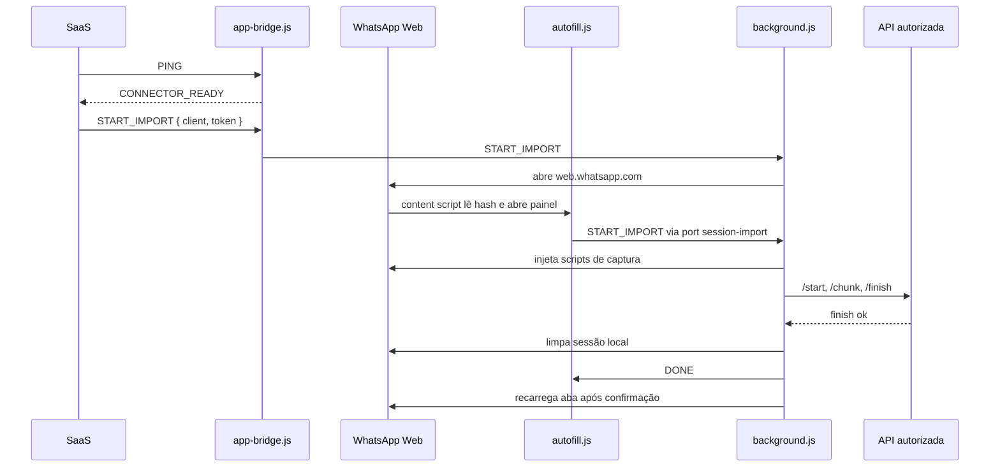

# Guia para desenvolvedores

Este documento explica como a extensão funciona, por que algumas decisões foram tomadas e quais pontos são seguros para adaptar em forks ou integrações com o SaaS.

A extensão foi criada para um fluxo específico: pegar uma sessão já autenticada no WhatsApp Web e enviar essa sessão para uma instância autorizada.

## Visão geral

Existem três contextos diferentes:

1. **Página do SaaS/Plataforma**: pode detectar a extensão e abrir o WhatsApp Web com os dados da instância.
2. **Content script do WhatsApp Web**: mostra o painel flutuante, lê `client` e `token` da URL e conversa com o background.
3. **Background service worker**: executa o fluxo pesado, injeta scripts no WhatsApp Web, converte dados e envia para a API.

O SaaS não acessa os dados internos do WhatsApp Web. Ele apenas envia um comando para a extensão abrir a aba correta. A captura da sessão acontece dentro da aba `https://web.whatsapp.com`.



## Arquivos principais

- `src/customization.ts`: primeira parada para forks. Textos, domínio, endpoints, header de auth, limites e hosts da bridge.
- `src/shared/config.ts`: constantes derivadas da customização.
- `src/shared/url.ts`: normalização do nome da assinatura/domínio e leitura do hash `#client=&token=`.
- `src/content/index.ts`: painel dentro do WhatsApp Web.
- `src/content/app-bridge.ts`: bridge opcional para páginas do SaaS via `postMessage`.
- `src/background/index.ts`: orquestração da importação.
- `src/background/api.ts`: contrato HTTP com a API.
- `src/background/chunks.ts`: quebra do payload em partes menores.
- `src/background/conversion.ts`: adaptação do dump do WhatsApp Web para o payload usado pela API.
- `src/background/page-scripts/`: funções autocontidas injetadas na página do WhatsApp Web.
- `scripts/build-extension.mjs`: gera `dist/background.js`, `dist/autofill.js`, `dist/app-bridge.js` e copia o manifest.

## Como rodar em desenvolvimento

```bash
npm install
npm run build
```

Depois carregue a pasta `dist` no Chrome/Edge:

```text
chrome://extensions
```

Use **Carregar sem compactação** e selecione a pasta `dist`.

Sempre que alterar `src/`, rode `npm run build` novamente e clique em **Reload** na extensão.

## Como a assinatura vira URL da API

O campo exibido como "Nome da assinatura" usa o parâmetro interno `client`.
Ele pode receber um nome curto, um host ou uma URL completa.

Exemplos:

```text
minhaempresa       -> https://minhaempresa.uazapi.com
api.exemplo.com    -> https://api.exemplo.com
https://xpto.com   -> https://xpto.com
```

Essa regra fica em `src/shared/url.ts`, na função `normalizeBaseUrl`.

O pacote de producao rejeita `http://`, `localhost` e `127.*`. Para testes
locais, use um fork/build de desenvolvimento e adicione explicitamente os hosts
locais no manifesto e em `appBridge.matches`.

Para mudar o domínio padrão `uazapi.com`, altere:

```ts
// src/customization.ts
api: {
  clientBaseDomain: "uazapi.com"
}
```

## Contrato com a API

Hoje a autenticação usa o header `token`, porque as rotas de instância da API autorizada já usam esse padrão.

Para trocar por `Authorization: Bearer`, query string, URL assinada ou outro modelo, o ponto principal é `src/background/api.ts`.

Endpoints usados:

```text
GET  /instance/status
POST /instance/import-web-session/start
POST /instance/import-web-session/chunk
POST /instance/import-web-session/finish
POST /instance/import-web-session/history
```

Esses paths vêm de:

```ts
// src/customization.ts
api: {
  paths: {
    instanceStatus: "/instance/status",
    importWebSessionStart: "/instance/import-web-session/start",
    importWebSessionChunk: "/instance/import-web-session/chunk",
    importWebSessionFinish: "/instance/import-web-session/finish",
    importWebSessionHistory: "/instance/import-web-session/history"
  }
}
```

### 1. Validar instância

Antes de capturar a sessão:

```text
GET /instance/status
```

A extensão espera que a instância esteja desconectada ou em importação. Isso evita conectar a mesma conta em dois lugares ao mesmo tempo.

### 2. Iniciar job de importação

```text
POST /instance/import-web-session/start
```

Payload:

```json
{
  "device": {},
  "expected": {
    "preKeys": 0,
    "identityKeys": 0,
    "sessions": 0,
    "senderKeys": 0,
    "appStateSyncKeys": 0,
    "appStateVersions": 0,
    "appStateMutationMACs": 0,
    "contacts": 0,
    "privacyTokens": 0,
    "nctSalt": 0,
    "validatedHistoryChats": 0,
    "validatedHistoryMessages": 0
  }
}
```

A API deve retornar:

```json
{
  "jobId": "id-do-job"
}
```

Também aceitamos `job_id` por compatibilidade.

### 3. Enviar chunks

```text
POST /instance/import-web-session/chunk
```

Payload:

```json
{
  "jobId": "id-do-job",
  "section": "sessions",
  "seq": 0,
  "count": 1000,
  "sha256": "hash-do-payload",
  "payload": {}
}
```

O campo `sha256` é calculado sobre o JSON de `payload`. Ele ajuda a API a detectar chunk corrompido ou diferente do que a extensão pretendia enviar.

### 4. Finalizar importação

```text
POST /instance/import-web-session/finish
```

Payload:

```json
{
  "jobId": "id-do-job"
}
```

Depois do `finish`, a credencial já foi importada. Se histórico estiver ligado,
a extensão tenta repassar as âncoras antes de limpar o WhatsApp Web local.

### 5. Repassar histórico

```text
POST /instance/import-web-session/history
```

O histórico é ligado por padrão no painel, mas roda depois que a sessão já foi
importada. Essa separação é intencional: o cache do WhatsApp Web varia muito por
conta/dispositivo, então falha de histórico vira aviso e não cancela a migração
da credencial.

Payload:

```json
{
  "contacts": [],
  "history": {
    "chats": [],
    "messages": []
  }
}
```

Para adaptar para outra API, o caminho mais simples é trocar
`api.paths.importWebSessionHistory` em `src/customization.ts` e ajustar
`uploadHistoryOnlyPayload` em `src/background/api.ts`.

### 6. Limpar sessão local

Depois do histórico, ou depois do aviso quando o histórico falha, a extensão
limpa a sessão local do WhatsApp Web. A extensão não chama `/instance/connect`.
Se o `finish` retornar `connect_queued=true`, o painel mostra a conexão em
andamento; se retornar `false`, a importação ainda termina normalmente e o
backend/watchdog fica responsável por reconectar a instância.

## Por que enviamos em chunks

O dump do WhatsApp Web pode ser grande. Enviar tudo em uma única requisição aumenta risco de:

- timeout;
- payload grande demais;
- service worker MV3 ser encerrado;
- navegador travar;
- perda difícil de diagnosticar.

Por isso `src/background/chunks.ts` divide o envio por seção:

- `sessions`;
- `identities`;
- `senderKeys`;
- `preKeys`;
- `appStateSyncKeys`;
- `appState`;
- `contacts`;
- `privacyTokens`;
- `nctSalt`;
- `historyChats`;
- `historyMessages`.

No fluxo padrão, `historyChats` e `historyMessages` não são enviados pelo job
principal. Eles ficam no endpoint `/instance/import-web-session/history`, depois
da sessão já importada, para que histórico não bloqueie a migração. O suporte a
chunks de histórico continua em `src/background/chunks.ts` para forks que queiram
usar tudo no mesmo job.

O limite padrão fica em:

```ts
// src/customization.ts
importLimits: {
  chunkItems: 1000,
  historyChatLimit: 5000
}
```

## Por que esperamos a sessão estabilizar

Quando o WhatsApp Web acaba de conectar, alguns dados podem aparecer alguns segundos depois de outros.

A extensão espera leituras consecutivas com:

- `device.meJid`;
- `device.noiseKey`;
- `device.identityKey`;
- `device.account`;
- mesmo `meJid`.

Isso evita importar um dump incompleto enquanto o WhatsApp Web ainda está terminando de carregar a sessão.

Essa lógica fica em `src/background/index.ts`, em `waitForStableMainDump`.

## Por que limpamos a sessão local

Depois da importação, a mesma conta pode ficar ativa em dois lugares:

1. no WhatsApp Web usado para capturar;
2. na instância conectada pela API.

Isso pode causar desconexões, mensagens perdidas ou comportamento instável.

Por padrão, a extensão limpa a sessão local depois que a API confirma a importação. A reconexão da instância fica a cargo do backend/watchdog; a extensão não chama `/instance/connect`.

No painel existe a opção técnica de não limpar a sessão local, mas ela deve ser usada apenas para depuração.

## Histórico e âncoras

O histórico disponível no WhatsApp Web não é uma exportação completa confiável.

O navegador pode ter:

- chats incompletos;
- mensagens antigas ausentes;
- mensagens sem texto;
- cache parcialmente carregado;
- diferenças entre contas, dispositivos e versões do WhatsApp Web.

Por isso a extensão não tenta vender o cache do navegador como histórico completo.

A decisão atual é enviar no máximo uma mensagem recente por chat como **âncora**. Essa âncora pode conter ID/timestamp suficientes para o backend usar a própria biblioteca WhatsApp e carregar histórico antes/depois dessa referência.

Na importação normal, essas âncoras são enviadas em uma etapa separada depois do
job de sessão. Se a captura ou o endpoint de histórico falhar, a extensão mostra
um aviso, mas mantém a sessão importada e segue com limpeza/conexão.

Por performance, a extensão não chama APIs internas de `load earlier` e não tenta
descriptografar vizinhos da mensagem. Ela só usa mensagens já carregadas ou linhas
recentes do IndexedDB, mantendo uma única âncora por chat.

Também não exportamos `messageSecrets` das âncoras. Eles não são necessários para
pedir o history sync; servem para descriptografar recursos derivados de mensagens
específicas, como votos, reações, edições, eventos e alguns payloads de bot/report.
Exportar esse estado pelo WhatsApp Web deixaria a captura mais lenta e incompleta.
No `whatsmeow`, o pedido de histórico on-demand usa `chatJID`, `messageID`,
`fromMe`, `timestamp` e `count`; `messageSecret` não faz parte da âncora.
Quando o WhatsApp entrega um history sync, o próprio `whatsmeow` extrai e
persiste os `messageSecrets` presentes naquele pacote.

Essa lógica fica em:

- `src/background/page-scripts/extract-history.ts`;
- `src/background/conversion.ts`, em `limitHistoryAnchors`.

## Scripts injetados no WhatsApp Web

Os arquivos em `src/background/page-scripts/` precisam ser autocontidos.

Eles são executados com `chrome.scripting.executeScript`, dentro do contexto da página do WhatsApp Web. Por isso não devem depender de imports internos serializados em runtime.

Regra prática:

- código de orquestração fica em `src/background`;
- UI fica em `src/content`;
- funções injetadas ficam completas em `src/background/page-scripts`;
- helpers compartilhados que precisam rodar fora da página ficam em `src/shared`.

## Integração por URL

O jeito mais simples de automatizar é abrir:

```text
https://web.whatsapp.com/#client=CLIENTE&token=TOKEN
```

O hash `#client=&token=` não é enviado como rota HTTP para o servidor do WhatsApp Web, mas ainda aparece na barra de endereço por alguns instantes. Por isso o content script remove esses parâmetros assim que lê os dados.

Esse fluxo é bom para:

- link enviado pelo suporte;
- botão no painel da plataforma;
- fallback quando a bridge não está disponível.

## Formas recomendadas para um SaaS incorporar

A opção mais simples é usar a extensão do jeito que ela já está: o SaaS gera uma URL com `client` e `token`, abre o WhatsApp Web e a extensão faz o resto. A própria extensão remove `client` e `token` da barra de endereço depois de ler.

`PING`, bridge e remoção dos campos da UI são camadas extras. Elas podem melhorar experiência e controle, mas não mudam o contrato público de integração com o backend autorizado.

Existem três níveis práticos de incorporação. A escolha depende de como o SaaS quer abrir o WhatsApp Web, se precisa detectar a extensão e se roda em domínio permitido pela extensão.

Resumo de decisão:

```text
Quer o menor esforço, sem fork?
-> Gere o link web.whatsapp.com#client=...&token=...

Quer detectar a extensão e abrir com um botão?
-> Use PING + START_IMPORT com client/token.

SaaS está em domínio próprio?
-> Adicione o domínio em appBridge.matches e manifest.json, ou use link direto como fallback.
```

### Opção 1: extensão atual + backend autorizado direto

Essa é a melhor opção para começar, porque não exige fork da extensão nem gateway no SaaS do cliente.

Use quando:

- o SaaS consegue obter `client` e `token` no backend dele ou no nosso painel;
- o token pode ser entregue para a extensão no navegador do operador;
- o cliente aceita o fluxo atual com painel de confirmação.

Fluxo mínimo:

1. SaaS gera `https://web.whatsapp.com/#client=CLIENTE&token=TOKEN`.
2. Usuário abre o link.
3. Extensão lê o hash, remove `client` e `token` da barra de endereço e abre o painel.
4. Extensão captura a sessão e chama o backend autorizado diretamente.

Fluxo com melhor UX:

1. SaaS chama `PING` para detectar a extensão.
2. SaaS busca `client` e `token` no backend.
3. SaaS envia `START_IMPORT { client, token }` via bridge.
4. Extensão abre `https://web.whatsapp.com/#client=...&token=...`.
5. Extensão remove o hash, captura a sessão e chama o backend autorizado diretamente.

Vantagens:

- usa o código atual;
- usa nosso backend diretamente;
- não exige gateway no SaaS do cliente;
- com bridge, permite detectar extensão instalada e abrir WhatsApp Web com um botão.

Limites:

- o token chega ao navegador do operador;
- o hash aparece na barra por alguns instantes até a extensão remover;
- sem bridge, o SaaS não sabe se a extensão está instalada;
- em domínio próprio, a bridge precisa ser permitida no `manifest.json`.

### Opção 2: bridge como melhoria de experiência

Use a bridge quando o SaaS quiser detectar se a extensão está instalada e abrir o WhatsApp Web com um botão. Ela não muda o contrato com o backend autorizado: a extensão ainda recebe `client` e `token`, captura a sessão e chama a API autorizada diretamente.

Se a bridge não responder, use o link direto como fallback:

```text
https://web.whatsapp.com/#client=CLIENTE&token=TOKEN
```

Esse fallback deve continuar existindo mesmo quando a bridge é usada, porque cobre:

- extensão instalada depois que a página do SaaS abriu;
- navegador bloqueando bridge;
- domínio do SaaS ainda não incluído no manifest;
- atendimento manual pelo suporte.

### Opção 3: bridge em domínio próprio

Se o SaaS do cliente não roda em `*.uazapi.com`, a bridge só funciona se o domínio for explicitamente permitido.

Atualize:

- `src/customization.ts`, em `appBridge.matches`;
- `manifest.json`, em `host_permissions`;
- `manifest.json`, em `content_scripts[].matches` para o `app-bridge.js`.

Depois rode `npm run build`.

Essa opção não muda o contrato com a API autorizada. Ela só permite que o SaaS do cliente use `PING` e `START_IMPORT` em vez de depender apenas de link direto.

## Integração por bridge no SaaS

A bridge permite que uma página do SaaS descubra se a extensão está instalada e abra o WhatsApp Web com um clique.

Ela roda apenas nos hosts permitidos pelo manifest.

Hoje os hosts são:

```text
https://*.uazapi.com/*
```

Se mudar `appBridge.matches` em `src/customization.ts`, atualize também `manifest.json` em:

- `host_permissions`;
- `content_scripts[].matches` do `app-bridge.js`.

Depois rode `npm run build`.

### Dá para saber se a extensão está instalada?

Sem a extensão cooperar, não existe um comando confiável para um site descobrir se ela está instalada.

O navegador não permite que uma página web consulte livremente as extensões instaladas pelo usuário. Isso é uma proteção de privacidade e segurança.

Por isso, a detecção confiável precisa de um canal exposto pela própria extensão. Nesta extensão, esse canal é a bridge `postMessage`:

- o SaaS envia `PING`;
- a extensão responde `CONNECTOR_READY`.

Se o SaaS receber `CONNECTOR_READY`, significa que a extensão está instalada, ativa e que a bridge carregou naquela página.

Se o SaaS não receber resposta, ele não consegue saber o motivo exato. Pode ser:

- extensão não instalada;
- extensão desativada;
- domínio do SaaS não permitido no `manifest.json`;
- página aberta antes da extensão ser instalada/recarregada;
- política do navegador bloqueando a extensão.

Resumo prático:

```text
SaaS em *.uazapi.com -> pode detectar com PING.
SaaS em localhost/127.0.0.1 -> precisa de um build de desenvolvimento com esses hosts adicionados.
SaaS em domínio próprio -> precisa adicionar o domínio no manifest/config da extensão antes de publicar/forkar.
Sem bridge/extensão cooperando -> não existe detecção confiável.
```

### Detectar extensão com PING

Use `PING` para saber se a extensão está disponível antes de mostrar o botão de importação automática.

```js
const CONNECTOR_SOURCE = "whatsapp-session-transfer";

function pingWhatsAppSessionTransfer(timeoutMs = 1500) {
  return new Promise((resolve) => {
    let done = false;

    const cleanup = () => {
      window.removeEventListener("message", onMessage);
      clearTimeout(timer);
    };

    const finish = (value) => {
      if (done) return;
      done = true;
      cleanup();
      resolve(value);
    };

    const onMessage = (event) => {
      if (event.source !== window) return;
      if (event.data?.source !== CONNECTOR_SOURCE) return;
      if (event.data?.type !== "CONNECTOR_READY") return;

      finish({
        installed: true,
        version: event.data.version || ""
      });
    };

    const timer = setTimeout(() => {
      finish({ installed: false, version: "" });
    }, timeoutMs);

    window.addEventListener("message", onMessage);
    window.postMessage({
      target: CONNECTOR_SOURCE,
      type: "PING"
    }, "*");
  });
}
```

### Abrir WhatsApp Web com um clique usando client/token

No fluxo atual, depois de buscar `client` e `token` no backend/SaaS, envie `START_IMPORT`.

```js
async function startImportWithOneClick({ client, token }) {
  const connector = await pingWhatsAppSessionTransfer();

  if (!connector.installed) {
    // Mostre instruções de instalação ou ofereça o link manual.
    window.open(
      `https://web.whatsapp.com/#client=${encodeURIComponent(client)}&token=${encodeURIComponent(token)}`,
      "_blank",
      "noopener,noreferrer"
    );
    return;
  }

  window.postMessage({
    target: "whatsapp-session-transfer",
    type: "START_IMPORT",
    client,
    token
  }, "*");
}
```

### Receber resultado da abertura da aba

```js
window.addEventListener("message", (event) => {
  if (event.source !== window) return;
  if (event.data?.source !== "whatsapp-session-transfer") return;

  if (event.data.type === "IMPORT_TAB_OPENED") {
    console.log("Aba do WhatsApp Web aberta");
  }

  if (event.data.type === "IMPORT_TAB_ERROR") {
    console.error("Falha ao abrir WhatsApp Web", event.data.error);
  }
});
```

`OPEN_WHATSAPP` também é aceito como alias de `START_IMPORT`.

## Fluxo sugerido no SaaS com backend autorizado direto

1. Usuário abre a tela da instância.
2. SaaS chama `PING`.
3. Se a extensão responder, habilita botão **Importar sessão pelo WhatsApp Web**.
4. Usuário clica no botão.
5. SaaS busca ou já possui `client` e `token`.
6. SaaS envia `START_IMPORT`.
7. Extensão abre `web.whatsapp.com#client=...&token=...`.
8. Usuário escaneia QR Code se ainda não estiver conectado.
9. Painel abre automaticamente.
10. Usuário confere os dados e clica em **Migrar sessão**.

Esse desenho mantém o clique no SaaS simples sem dar ao SaaS acesso direto ao armazenamento interno do WhatsApp Web.

## O que pode ser mudado em forks

Pontos seguros para customizar:

- marca/textos do painel em `src/customization.ts`;
- domínio padrão em `api.clientBaseDomain`;
- paths dos endpoints em `api.paths`;
- header de autenticação em `api.authHeaderName`;
- padrão de histórico ligado/desligado em `importDefaults.includeHistory`;
- hosts permitidos da bridge em `appBridge.matches` e `manifest.json`;
- tamanho dos chunks em `importLimits.chunkItems`;
- limite de chats considerados em `importLimits.historyChatLimit`;
- payload e autenticação HTTP em `src/background/api.ts`;
- layout do painel em `src/content/panel/template.ts`;
- regra de normalização do nome da assinatura em `src/shared/url.ts`.

Pontos que exigem mais cuidado:

- `src/background/page-scripts/`, porque rodam dentro da página do WhatsApp Web;
- `src/background/conversion.ts`, porque afeta o formato persistido pela API;
- `src/background/chunks.ts`, porque backend e extensão precisam concordar sobre seções, contagens e finalização;
- `src/shared/config.ts`, porque renomear mensagens exige manter content script e background sincronizados.

## O que não fazemos nesta versão

Esta versão de referência não implementa URL assinada, job temporário nem token de uso único.

O contrato atual continua sendo `client` + token da instância. Se quiser trocar para um fluxo com job assinado, o melhor ponto de adaptação é `src/background/api.ts`, mantendo a captura do WhatsApp Web igual.

Também não tentamos exportar histórico completo do WhatsApp Web. A extensão envia âncoras para que o backend use APIs mais confiáveis da biblioteca WhatsApp.

## Build e pacote

```bash
npm run typecheck
npm test
npm run build
npm run zip
npm run release
```

`npm run build` gera:

```text
dist/background.js
dist/autofill.js
dist/app-bridge.js
dist/manifest.json
dist/vendor/wa-store-migrate.bundle.js
```

`npm run zip` roda `typecheck`, testes, build e cria:

```text
whatsapp-web-session-importer.zip
```

`npm run release` é um alias para `npm run zip`.

O zip deve ser distribuído a partir do conteúdo de `dist`.
